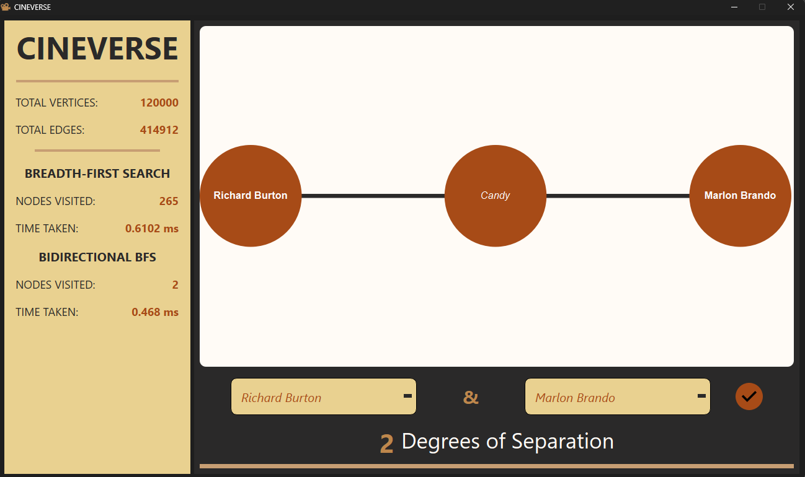

## CINEVERSE

This app helps visualize the connections between two actors to put the *Six Degrees of Separation* theory to the test! We pit an ordinary **Breadth-First Search** algorithm and a **Bidirectional Breadth-First Search** together to see which one could make this process even more efficient.

#### GETTING STARTED

Download the first, third, and sixth files from this website: https://datasets.imdbws.com/
(They are too big to be pushed to github)

Then, place in the src folder.
Run the project from project root with .\\src\\main.exe on vscode.
It will take a bit to load because of the scale of the datasets.

You will also need to install Qt 6.11, which you can get from here: https://doc.qt.io/qt-6/get-and-install-qt.html.

For this, you may need to update your cmake config to include the Qt compiler as an environment variable as well.

